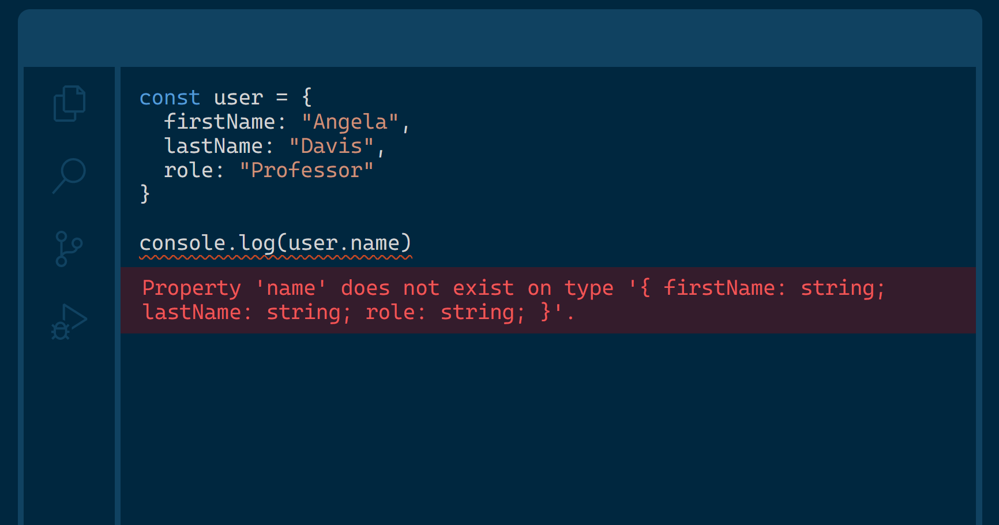
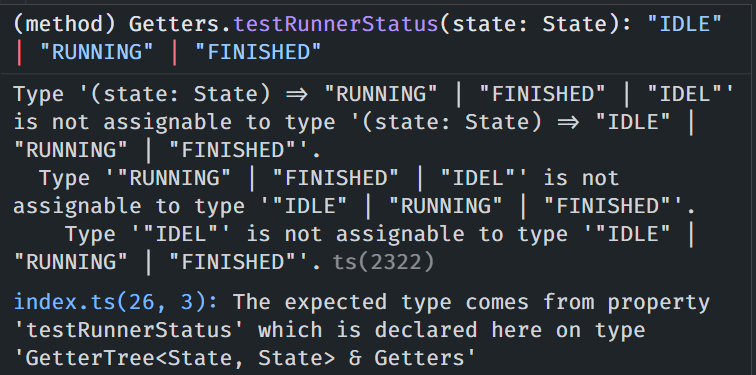
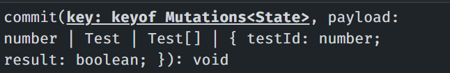
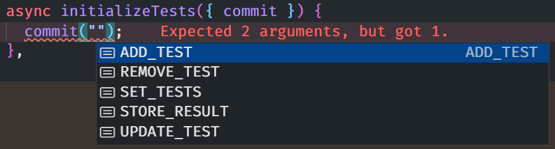
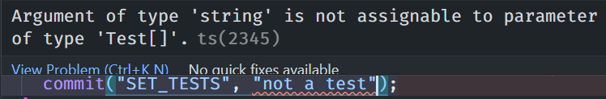
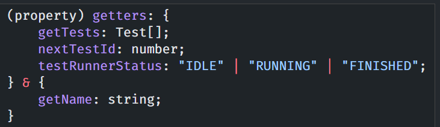
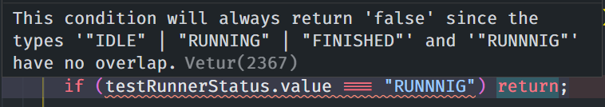
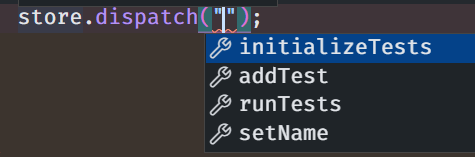

---
# try also 'default' to start simple
theme: default
# random image from a curated Unsplash collection by Anthony
# like them? see https://unsplash.com/collections/94734566/slidev
# background: https://source.unsplash.com/collection/94734566/1920x1080
# apply any windi css classes to the current slide
class: 'text-center'
# https://sli.dev/custom/highlighters.html
highlighter: shiki
# some information about the slides, markdown enabled
info: |
  ## Slidev Starter Template
  Presentation slides for developers.

  Learn more at [Sli.dev](https://sli.dev)
download: true
---

# Upgrade Vue 3 to Typescript

Enabling types in a Vue 3 application

<div class="flex justify-center">
  
  
</div>

<style>
h1 {
  background-color: #2B90B6;
  background-image: linear-gradient(45deg, #146b8c 10%, #41b883 60%);
  background-size: 100%;
  -webkit-background-clip: text;
  -moz-background-clip: text;
  -webkit-text-fill-color: transparent; 
  -moz-text-fill-color: transparent;
}
</style>

<!--
The last comment block of each slide will be treated as slide notes. It will be visible and editable in Presenter Mode along with the slide. [Read more in the docs](https://sli.dev/guide/syntax.html#notes)
-->

---

<div grid="~ cols-3 gap-2 ">


<div class="col-span-2 text-center flex flex-col justify-between">

# Lindsay Wardell

<v-clicks>

<div>

#### Software Engineer

<svg class="m-auto" width="152" height="34" viewBox="0 0 152 34" fill="none"><g><path d="M4.85364 3.49152H0V0.312256H13.4485V3.49152H8.59491V18.5523H4.85364V3.49152Z" fill="#ECF1F7"></path><path d="M21.7534 0.312256H25.4912V8.44244H31.9823V0.312256H35.7201V18.5523H31.9823V11.6217H25.4912V18.5523H21.7534V0.312256Z" fill="#ECF1F7"></path><path d="M49.1892 0.312256V18.5523H45.4514V0.312256H49.1892Z" fill="#ECF1F7"></path><path d="M58.0122 13.7052H61.8018C61.9331 15.0088 62.8417 15.6329 64.1129 15.6329C65.3842 15.6329 66.2167 14.8771 66.2167 13.7052C66.2167 12.5334 65.4878 11.8538 63.0213 10.838C59.4009 9.34023 58.1158 7.62058 58.1158 4.9475C58.1158 1.95199 60.2957 -0.00341797 63.802 -0.00341797C67.0493 -0.00341797 69.4882 1.92425 69.4882 5.10352H65.6986C65.6986 3.98367 64.9731 3.22786 63.7502 3.22786C62.5031 3.22786 61.9055 3.98367 61.9055 4.8955C61.9055 5.99108 62.6586 6.62901 65.2011 7.72113C68.8353 9.28476 70.0029 10.9247 70.0029 13.4799C70.0029 16.6973 67.7195 18.8607 64.0577 18.8607C60.3993 18.8676 58.2195 16.6245 58.0122 13.7052Z" fill="#ECF1F7"></path><path d="M88.2982 18.5523H82.2217V0.312256H88.2982C94.1917 0.312256 98.1644 3.64754 98.1644 9.43402C98.1644 15.2448 94.1917 18.5523 88.2982 18.5523ZM88.3224 3.49152H85.9595V15.373H88.3224C91.7251 15.373 94.3713 13.3934 94.3713 9.45829C94.3713 5.4712 91.7251 3.49152 88.3224 3.49152Z" fill="#ECF1F7"></path><path d="M143.405 3.49152H138.551V0.312256H152V3.49152H147.143V18.5523H143.405V3.49152Z" fill="#ECF1F7"></path><path d="M82.4255 25.5232H84.0284V31.9857H87.1583V33.3517H82.4255V25.5232Z" fill="#F46663"></path><path d="M106.604 32.1915H103.239L102.794 33.3564H101.122L104.276 25.5278H105.568L108.722 33.3564H107.05L106.604 32.1915ZM103.75 30.8497H106.089L104.918 27.8091L103.75 30.8497Z" fill="#F46663"></path><path d="M122.146 25.5278H124.854C126.616 25.5278 127.594 26.4882 127.594 27.7641C127.594 28.3916 127.269 29.0954 126.602 29.397C127.404 29.6432 127.95 30.347 127.95 31.1756C127.95 32.5971 127.058 33.3564 124.996 33.3564H122.143V25.5278H122.146ZM124.799 26.8696H123.752V28.8492H124.799C125.67 28.8492 125.991 28.4817 125.991 27.8542C125.991 27.2267 125.67 26.8696 124.799 26.8696ZM123.752 30.191V32.0146H125.134C125.981 32.0146 126.295 31.6783 126.295 31.1098C126.295 30.5377 125.984 30.1945 125.134 30.1945H123.752V30.191Z" fill="#F46663"></path><path d="M142.766 27.5179C142.766 26.2524 143.657 25.3926 145.274 25.3926C146.02 25.3926 146.791 25.5937 147.368 25.9404L146.877 27.2162C146.476 26.9493 145.941 26.7794 145.43 26.7794C144.728 26.7794 144.393 27.036 144.393 27.4381C144.393 27.875 144.683 28.1385 145.741 28.6239C147.105 29.2514 147.758 29.9413 147.758 31.1167C147.758 32.5589 146.777 33.4881 144.939 33.4881C144.127 33.4881 143.257 33.2523 142.6 32.8502L143.091 31.5535C143.592 31.9002 144.272 32.1013 144.873 32.1013C145.654 32.1013 146.134 31.7893 146.134 31.2449C146.134 30.6694 145.727 30.3435 144.77 29.9275C143.219 29.2514 142.766 28.5302 142.766 27.5179Z" fill="#F46663"></path><path d="M118.387 14.9464C121.509 14.9464 124.039 12.407 124.039 9.27436C124.039 6.14176 121.509 3.60229 118.387 3.60229C115.266 3.60229 112.736 6.14176 112.736 9.27436C112.736 12.407 115.266 14.9464 118.387 14.9464Z" fill="#F46663"></path><path d="M127.113 0.156006H122.46L129.438 9.2743L122.46 18.3961H127.113L134.092 9.2743L127.113 0.156006Z" fill="#9FACCC"></path><path d="M109.661 0.156006H114.314L107.336 9.2743L114.314 18.3961H109.661L102.683 9.2743L109.661 0.156006Z" fill="#9FACCC"></path></g></svg>

</div>

https://labs.thisdot.co/jobs

</v-clicks>

<div class="flex justify-around">

<v-clicks>


</v-clicks>

</div>

</div>

</div>

<div class="abs-bl m-6 text-xl !border-none text-right">
  <div class="flex">
    <carbon-logo-twitter class="w-16" />  <span>lindsaykwardell</span>
  </div>
  <div class="flex">
    <carbon-logo-github class="w-16" /> <span> lindsaykwardell</span>
  </div>
  <div class="flex underline">
    <div class="w-16" /> lindsaykwardell.com
  </div>
</div>

---

<div grid="~ cols-2 gap-2">

<div>

<div class="abs-tr m-6">
  
</div>

# What is Typescript?

TypeScript extends JavaScript by adding types.

By understanding JavaScript, TypeScript saves you time catching errors and providing fixes before you run code.

<!-- https://sli.dev/guide/syntax.html#line-highlighting -->

```ts {all|5|7-10}
import { ref, defineComponent } from 'vue';

export default defineComponent({
  setup() {
    const username = ref("");

    username.value = 7;
    username.value = {
      type: "not a string"
    };

    return {
      username
    };
  }
});
```

</div>

<div class="flex items-center">



</div>

</div>

---

<div grid="~ cols-2 gap-2">

<div>

<div class="abs-tr m-6">
  
</div>

# What is Typescript?

TypeScript extends JavaScript by adding types.

By understanding JavaScript, TypeScript saves you time catching errors and providing fixes before you run code.

<!-- https://sli.dev/guide/syntax.html#line-highlighting -->

```ts {all|5|7-10|all}
import { ref, defineComponent } from 'vue';

export default defineComponent({
  setup() {
    const username = ref<string>("");

    username.value = 7; // Not possible!
    username.value = {
      type: "not a string"
    };

    return {
      username
    };
  }
});
```

</div>

<div class="flex items-center">


</div>

</div>

---

<div class="abs-tr m-6">
  
</div>

# Why use Typescript?

What benefits do we get by using Typescript?

<div class="text-3xl">

<v-clicks>

- Improved Developer Experience
- More predictable codebase
- Static Testing
- In-Code Documentation
- <span class="vue-gradient">Built-in Support for Vue!</span>

</v-clicks>

</div>

<style>
.vue-gradient {
  background-color: #2B90B6;
  background-image: linear-gradient(45deg, #146b8c 10%, #41b883 60%);
  background-size: 100%;
  font-weight: bold;
  -webkit-background-clip: text;
  -moz-background-clip: text;
  -webkit-text-fill-color: transparent; 
  -moz-text-fill-color: transparent;
}
</style>

---

# Example App - Test Runner

<video controls class="h-100 m-auto">
  <source src="/video/vue-training-ts.mp4" type="video/mp4">
</video>

---

# Add Typescript to Vue

Vue CLI


terminal:

```
$ vue add typescript
```

https://cli.vuejs.org/core-plugins/typescript.html

---

# Add Typescript to Vue

Nuxt


terminal:

```
$ npm install --save-dev @nuxt/typescript-build @nuxt/types
```

nuxt.config.js:

```js
export default {
  buildModules: ['@nuxt/typescript-build']
}
```

https://typescript.nuxtjs.org/guide/setup#configuration

---

# Add Typescript to Vue

tsconfig.js

```json {all|12}
{
  "compilerOptions": {
    "target": "ES2018",
    "module": "ESNext",
    "moduleResolution": "Node",
    "lib": [
      "ESNext",
      "ESNext.AsyncIterable",
      "DOM"
    ],
    "esModuleInterop": true,
    "allowJs": true,
    "sourceMap": true,
    "strict": true,
    "noEmit": true,
    "baseUrl": "."
  },
}
```

---

# Add Typescript to Vue

shims-vue.d.ts

```ts
/* eslint-disable */
declare module '*.vue' {
  import type { DefineComponent } from 'vue'
  const component: DefineComponent<{}, {}, any>
  export default component
}
```

---

# Add Types - Vuex (State)

```ts
interface State {
  tests: Test[];
}

const state: State = {
  tests: [],
};
```

---

# Add Types - Vuex (Getters)

<div grid="~ cols-3 gap-2">
<div class="col-span-2">

```ts {all|1-5|7-21|2,8-10|3,11|4,12-20}
interface Getters {
  getTests(state: State): Test[];
  nextTestId(state: State): number;
  testRunnerStatus(state: State): "IDLE" | "RUNNING" | "FINISHED";
}

const getters: GetterTree<State, State> & Getters = {
  getTests: (state) => {
    return [...state.tests].sort(sortTests);
  },
  nextTestId: (state) => state.tests.length + 1,
  testRunnerStatus: (state) => {
    if (!state.tests.find((test) => test.status !== "IDLE")) {
      return "IDLE";
    } else if (state.tests.find((test) => test.status === "RUNNING")) {
      return "RUNNING";
    } else {
      return "FINISHED";
    }
  },
};
```

</div>

<div class="flex flex-col items-center justify-center">

<v-clicks>



</v-clicks>

</div>

</div>

---

# Add Types - Vuex (Mutations)

```ts {all|1-6|8-23|2,9-13}
interface Mutations<S = State> {
  SET_TESTS(state: S, tests: Test[]): void;
  ADD_TEST(state: S, test: Test): void;
  UPDATE_TEST(state: S, updatedTest: Test): void;
  STORE_RESULT(state: S, payload: { testId: number; result: boolean }): void;
}

const mutations: MutationTree<State> & Mutations = {
  SET_TESTS(state, tests) {
    if (!state.tests.length) {
      state.tests = [...tests];
    }
  },
  ADD_TEST(state, test) {
    ...
  },
  UPDATE_TEST(state, updatedTest) {
    ...
  },
  STORE_RESULT(state, { testId, result }) {
    ...
  },
};
```

---

# Add Types - Vuex (Actions)

```ts {all|1-9|2-5|6-8|9|11-15}
type AugmentedActionContext = {
  commit<K extends keyof Mutations>(
    key: K,
    payload: Parameters<Mutations[K]>[1]
  ): ReturnType<Mutations[K]>;
  getters: {
    [K in keyof Getters]: ReturnType<Getters[K]>;
  };
} & Omit<ActionContext<State, State>, "commit" | "getters">;

interface Actions {
  initializeTests(context: AugmentedActionContext, payload: Test[]): Promise<void>;
  addTest(context: AugmentedActionContext, payload: Test): void;
  runTests(context: AugmentedActionContext): void;
}
```

---

# Add Types - Vuex (Actions)

<div grid="~ cols-3 gap-2">
<div class="col-span-2">

```ts {all|1|2-4}
const actions: ActionTree<State, State> & Actions = {
  async initializeTests({ commit }) {
    commit("SET_TESTS", await getInitialTests());
  },
  addTest({ commit, getters }, payload) {
    commit("ADD_TEST", { ...payload, id: getters.nextTestId });
  },
  runTests({ commit, getters }) {
    getters.getTests.forEach(async (test) => {
      commit("UPDATE_TEST", {
        ...test,
        status: "RUNNING",
      });

      const delay = 2000 + Math.random() * 2000;
      const testPassed = Math.random() > 0.5;

      await waitfor(delay);

      commit("STORE_RESULT", { testId: test.id, result: testPassed });
    });
  },
};
```

</div>

<div class="flex flex-col items-center justify-center">

<v-clicks>







</v-clicks>

</div>

</div>

---

# Add Types - Vuex (createStore)

```ts {all|1-4|5-9|10-14|15-17}
export type Store = Omit<
  VuexStore<State>,
  "getters" | "commit" | "dispatch"
> & {
  commit<K extends keyof Mutations, P extends Parameters<Mutations[K]>[1]>(
    key: K,
    payload: P,
    options?: CommitOptions
  ): ReturnType<Mutations[K]>;
  dispatch<K extends keyof Actions>(
    key: K,
    payload?: Parameters<Actions[K]>[1],
    options?: DispatchOptions
  ): ReturnType<Actions[K]>;
  getters: {
    [K in keyof Getters]: ReturnType<Getters[K]>;
  };
};
```

---

# Add Types - Vuex (createStore)

```ts
const store: Store = createStore({
  state,
  getters,
  mutations,
  actions,
});

export default store;
```

---

# Add Types - Components

```html {all|1|3-5|2,7}
<script lang="ts">
import { defineComponent } from "vue";
import Header from "@/components/Header.vue";
import TestList from "@/components/TestList.vue";
import TestRunner from "@/components/TestRunner.vue";

export default defineComponent({
  setup() {
    ...
  },
  components: {
    TestList,
    Header,
    TestRunner,
  },
});
</script>
```

---

# Utilize Types - Composition API

<div grid="~ cols-3 gap-2">

<div class="col-span-2">

```ts {all|2-3,7|8-9|11-15|all}
import { computed, defineComponent } from "vue";
import { Store } from "@/store";
import { useStore } from "vuex";

export default defineComponent({
  setup() {
    const store: Store = useStore();
    const testRunnerStatus = computed(() => store.getters.testRunnerStatus);
    const getTests = computed(() => store.getters.getTests);

    async function initTests(): Promise<void> {
      if (testRunnerStatus.value === "RUNNING") return;

      store.dispatch("runTests");
    }

    return {
      testRunnerStatus,
      getTests,
      initTests,
    };
  },
});
```

</div>

<div class="flex flex-col items-center justify-center">

<v-clicks>







</v-clicks>

</div>

</div>

---

# Utilize Types - Options API

```ts {all|3-6|7-10|13-17|18-20}
export default defineComponent({
  props: {
    testRunnerStatus: {
      type: String as () => "IDLE" | "RUNNING" | "FINISHED",
      default: "IDLE",
    },
    tests: {
      type: Array as () => Test[],
      default: () => [],
    },
  },
  computed: {
    testButtonClass(): string {
      if (this.testRunnerStatus === "RUNNING")
        return "bg-green-300 cursor-not-allowed";
      else return "bg-green-500 hover:bg-green-400";
    },
    totalRunningTests(): number {
      return this.tests.filter((test) => test.status === "RUNNING").length;
    },
  },
});
```

---

# Add Types - Router

```ts {all|1|2|4|5-17}
import { createRouter, createWebHashHistory, RouteRecordRaw } from "vue-router";
import Home from "../views/Home.vue";

const routes: RouteRecordRaw[] = [
  {
    path: "/",
    name: "Home",
    component: Home,
    beforeEnter(to, from, next) {
      const loggedIn = sessionStorage.getItem("tester-token");
      if (!loggedIn) {
        next({ path: "/login" });
      } else {
        next();
      }
    },
  },
];

const router = createRouter({
  history: createWebHashHistory(),
  routes,
});
```

---

# What do we have?

<v-clicks>

A typed application!  

</v-clicks>

<v-clicks>

- Vuex:
  - Getters/Mutations/Actions
  - Commit/Dispatch
- Components:
  - Props
  - state/computed/methods
  - Templates

</v-clicks>

---
layout: center
---

<div class="flex">

# <carbon-logo-github class="mr-6" /> 

# GitHub Repository:

</div>

https://github.com/lindsaykwardell/vue-global-summit


<div class="abs-bl m-6 text-xl !border-none text-right">
  <div class="flex">
    <carbon-logo-twitter class="w-16" />  <span>lindsaykwardell</span>
  </div>
  <div class="flex">
    <carbon-logo-github class="w-16" /> <span> lindsaykwardell</span>
  </div>
  <div class="flex underline">
    <div class="w-16" /> lindsaykwardell.com
  </div>
</div>